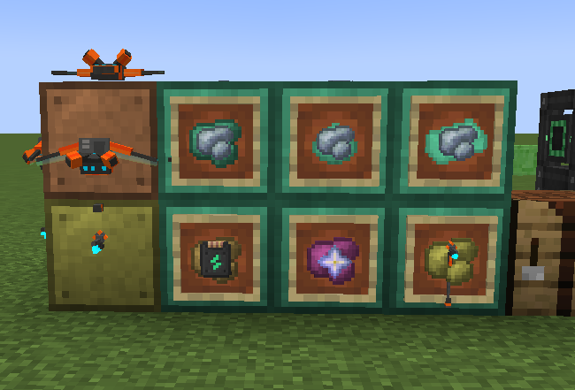

# Mekanism Everything Ore Processing

Mekanism のジョークアドオン。**あらゆるアイテムを「なんでも原石（Everything Raw Ore）」に変え、Mekanism の鉱石処理チェーンに乗せて増やし、元のアイテムに戻す。**

- Minecraft 1.21.1 / NeoForge 21.1 / Mekanism 10.7
- ライセンス: MIT（ベーステクスチャは MIT の Mekanism のものを灰色化して使用）



## 流れ

1. 作業台で、中央にオスミウム原石・周囲 8 マスにガラス → **なんでも原石（元情報なし）×1**
2. 作業台で、中央に元情報なしのなんでも原石・周囲 8 マスに同じ任意アイテム → **そのアイテムのなんでも原石 ×8**
3. Mekanism の機械で加工（比率は本家の原石と同じ）
   - Energized Smelter / かまど: 原石 → インゴット（1x）
   - Enrichment Chamber: 原石3 → ダスト4（約1.33x）
   - Purification Chamber: 原石 + O₂ → クランプ2（2x）
   - Chemical Injection Chamber: 原石3 + HCl → シャード8（約2.67x）
   - Dissolution → Washer → Crystallizer: 原石3 + H₂SO₄ → スラリー 2000mB → 結晶10（約3.33x）
4. **なんでもインゴット** を作業台に 1 個置く → **元アイテム**に復元

全ての「なんでも○○」は Data Component `original_item` に元アイテムを保持する。スラリー段階では化学物質に情報を載せられないため、**対象アイテム分の Dirty / Clean スラリーを起動時に動的登録**し、スラリーの種類そのもので元アイテムを表す。

## スラリー登録と起動負荷（重要）

5x（溶解）用に、対象アイテム **1 つあたり化学物質が 2 つ**増えます。whitelist が空だとほぼ全アイテムが対象になり、大型パックでは起動が重くなります。

- 設定ファイル: `config/mekanismeverythingoreprocessing-startup.toml`
- キー: `slurryNamespaceWhitelist`
- **空 `[]`** = air・本 mod アイテム以外を全部登録（便利だが重い。ログに WARN が出る）
- **絞る例**（バニラ＋Mekanism だけ）:

```toml
slurryNamespaceWhitelist = ["minecraft", "mekanism"]
```

whitelist 外のアイテムでも 1x〜4x・復元は普通に動きます。効くのは **5x だけ**で、対象外は汎用スラリー経由になり結晶に元情報が付きません。

## Config

| ファイル | キー | 内容 |
|---|---|---|
| `*-startup.toml` | `slurryNamespaceWhitelist` | 個別スラリーを作る namespace（**空＝ほぼ全部・重い**）。例: `["minecraft","mekanism"]` |
| `*-common.toml` | `originStorageMode` | `FULL_STACK`（既定・Component 保持）/ `ITEM_ID`（種類のみ・**入れ子不可**） |
| `*-common.toml` | `allowNesting` / `maxNestingDepth` | 入れ子変換の許可（**既定 false**）。`ITEM_ID` のときは強制オフ。許可時も溶解（5x）は入れ子を拒否 |
| `*-common.toml` | `blacklist` | 変換禁止アイテム（タグ `mekanismeverythingoreprocessing:blacklist` も有効） |

## 開発

```
gradlew.bat build       # ビルド
gradlew.bat runData     # src/generated/resources を再生成
gradlew.bat runClient   # クライアント起動
```

- ベーステクスチャの再生成: `scripts/generate_base_textures.ps1`（`D:\Mekanism` のソースが必要）
